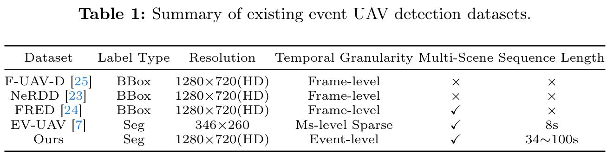

# Motion-Consistency-Based Asynchronous UAV Detection and Tracking with event camera

## ES-UAV DATASET
---
<p align="center">

 </a>
</p>
### 📂 Structure of EV-UAV

The file structure of the dataset is as follows:
```
ES-UAV/
├── val
├──────004.CSV
├──────005.CSV
├──────006.CSV
  ...          

```
### 📝 Data Format

Example:
```
x    y   polarity  timestamp   label id
1280 200    123         1        0    0 
128  720    123        -1        1    5
```
link: https://pan.baidu.com/s/16Tzi_2ExpGMcvgelTUxPdQ?pwd=jf4p 
---
