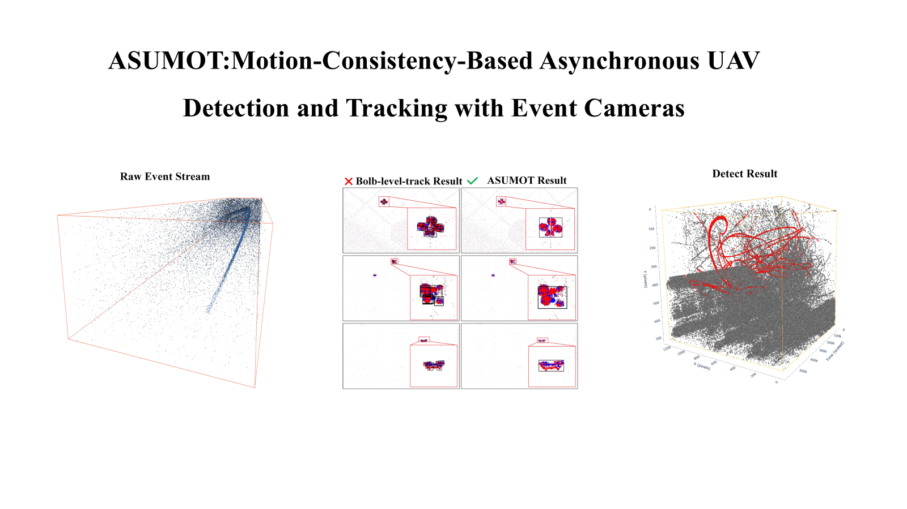
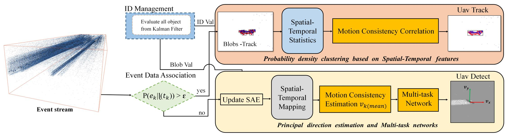
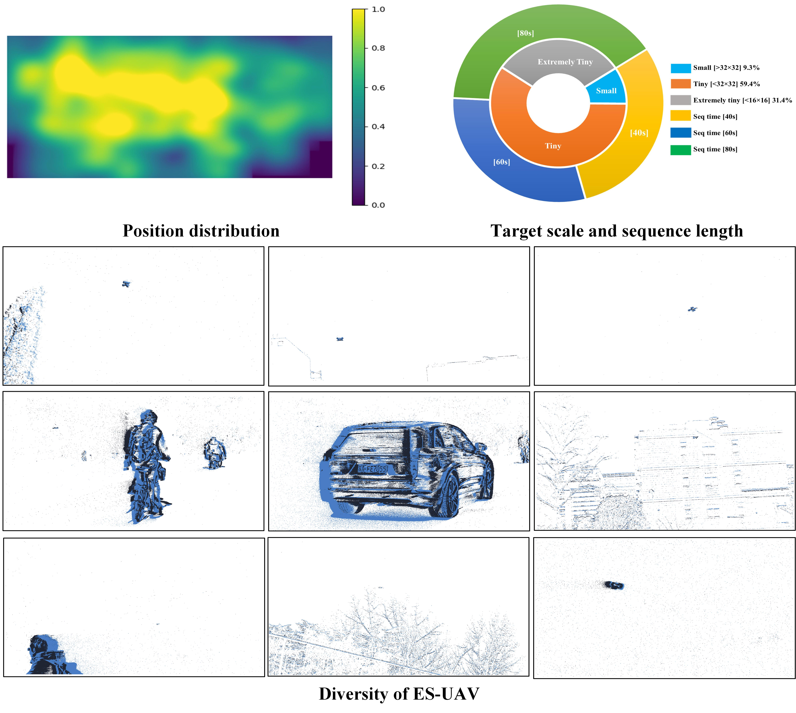

# ASUMOT: Motion-Consistency-Based Asynchronous UAV Detection and Tracking with event camera
<p align="center">

 </a>
</p>

## Overview
<p align="center">

 </a>
</p>

## ES-UAV DATASET
---
<p align="center">

 </a>
</p>
<p align="center">

 </a>
</p>

### 📂 Structure of EV-UAV

The file structure of the dataset is as follows:
```
ES-UAV/
├── val
├──────004.CSV
├──────005.CSV
├──────006.CSV
  ...          

```
### 📝 Data Format

Example:
```
x    y   polarity  timestamp   label id
1280 200    123         1        0    0 
128  720    123        -1        1    5
```

#### link(video):

https://pan.baidu.com/s/16Tzi_2ExpGMcvgelTUxPdQ?pwd=jf4p  
#### link(event): 

https://pan.baidu.com/s/18izbbPXYTzeJUI8kpe5o9Q?pwd=mn79

---
## Citation

If you use this work in your research, please cite it:

```bibtex
@misc{chen2025eventbasedtinyobjectdetection,
      title={Event-based Tiny Object Detection: A Benchmark Dataset and Baseline}, 
      author={Nuo Chen and Chao Xiao and Yimian Dai and Shiman He and Miao Li and Wei An},
      year={2025},
      eprint={2506.23575},
      archivePrefix={arXiv},
      primaryClass={cs.CV},
      url={https://arxiv.org/abs/2506.23575}, 
}
```
