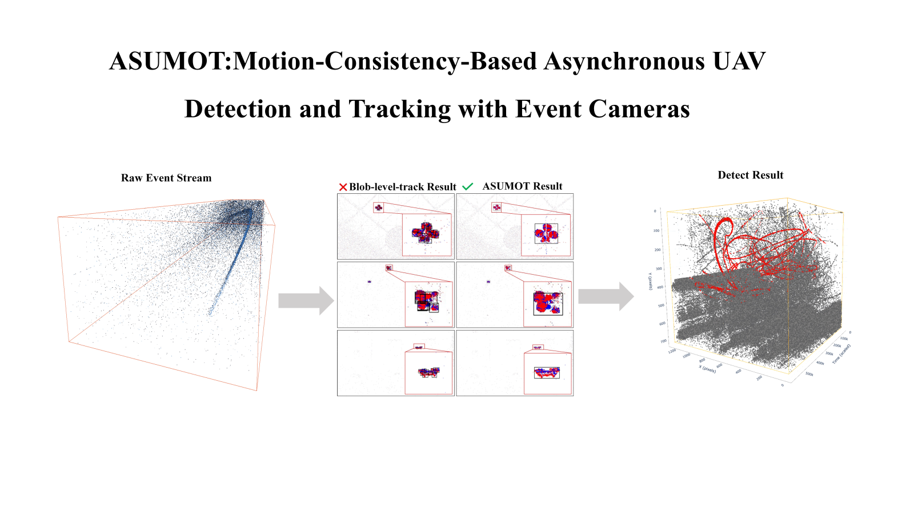
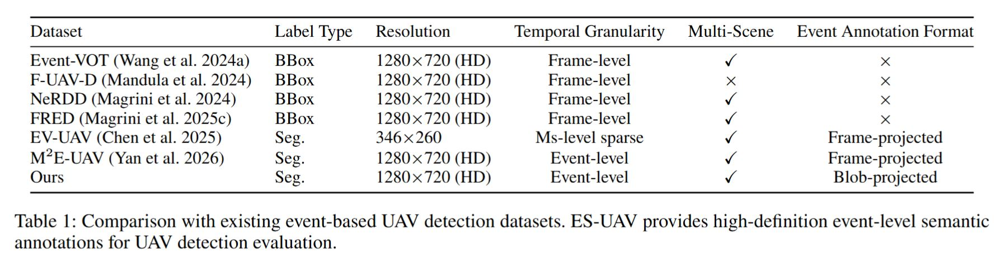
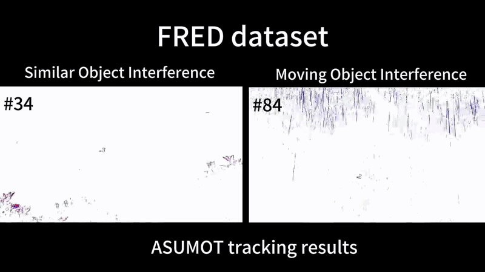
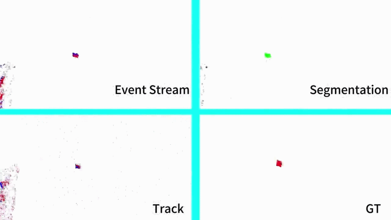

# ASUMOT: Motion-Consistency-Based Asynchronous UAV Detection and Tracking with event camera
<p align="center">
  <a href="https://arxiv.org/abs/2607.11303">
    
  </a>
</p>
<p align="center">
  
</p>

## Overview
<p align="center">

 </a>
</p>

## ES-UAV DATASET
---
<p align="center">

 </a>
</p>
<p align="center">

 </a>
</p>
<p align="center">
  
  
</p>

## 📂 Structure of ES-UAV

The file structure of the dataset is as follows:
```
ES-UAV/
├── val
├──────004.CSV
├──────005.CSV
├──────006.CSV
  ...          

```
## 📝 Data Format

Example:
```
x    y   polarity  timestamp   label id
1280 200    123         1        0    0 
128  720    123        -1        1    5
```

## 🔗 Link(Coming soon):

---
## Citation


```bibtex
@misc{jia2026asumotmotionconsistencybasedasynchronousuav,
      title={ASUMOT: Motion-Consistency-Based Asynchronous UAV Detection and Tracking with Event Cameras}, 
      author={Baofeng Jia and Xiaoyu Chen and Jingyuan Zhang and Zongze Wu and Haochen li and Jing Han and Lianfa Bai},
      year={2026},
      eprint={2607.11303},
      archivePrefix={arXiv},
      primaryClass={cs.CV},
      url={https://arxiv.org/abs/2607.11303}, 
}
```

